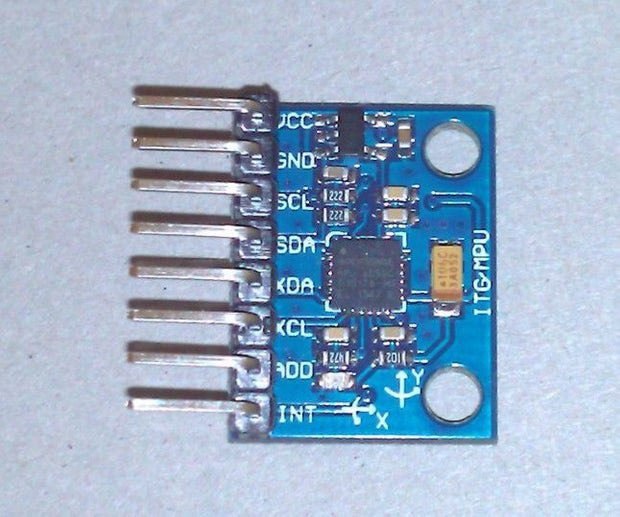
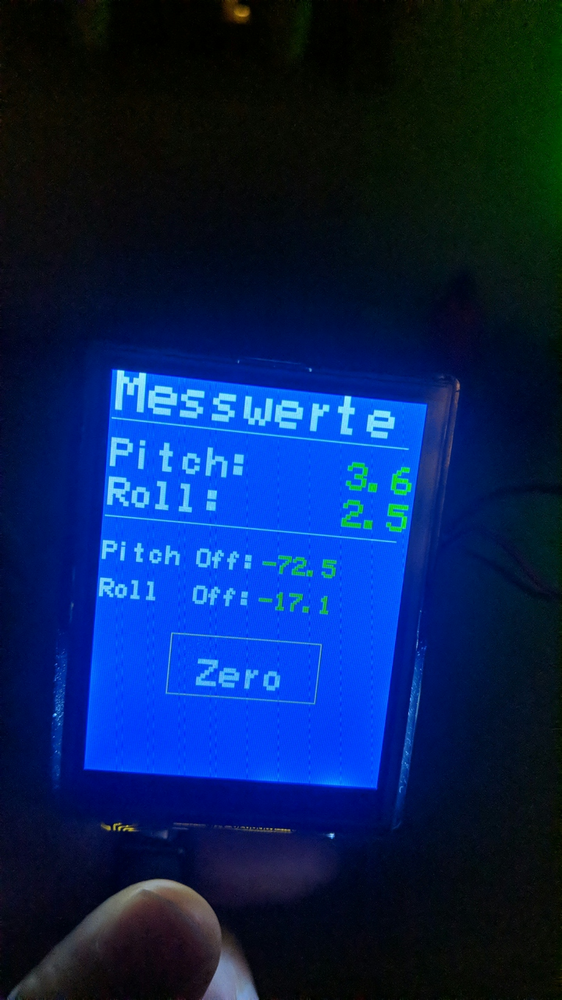

# Measure level of camper with MPU6050 and arduino UNO

The project was done by Mark and Uwe and is therefore called
M: machts
A: aufstellen
U: unheimlich
E: einfach

The app displays the Yaw-Pitch-Roll measurement of a sensor on an LCD screen. This shall help to place a camper level so that one doesn't fall out of bed.

- The file [`LCD_Test_serial_float_formatting.ino`](https://github.com/uwesterr/LevelMeasurementArduino/tree/master/LCD_Test_serial_float_formatting) has the sketch which runs on the Arduino UNO.  
- As screen the Arduino Shield - Display 2,8", Touch, 320 x 240, ILI9341 is used
- The IMU MPU-6050 Accelerometer + Gyro is used to measure the level via the accelerometers  

 <figure>
  
  <figcaption>Sensor MPU 6050</figcaption>
</figure> 
 

## Software design

The measurement values are read from the sensor by
`mpu.dmpGetYawPitchRoll(ypr, &q, &gravity);`

and then converted to degrees and offsets are subtracted

`fMesswertPitch = ypr[1] * 180/M_PI-fPitchOffset;`

To measure offsets press the **zero** button. The offset values are stored in the EEPROM with `EEPROM.put(addr, fPitchOffset);` and read back with `EEPROM.get(addr, fPitchOffset);`

Since the Arduino has no graphic memory pixels have to be overwritten before a new digit can be displayed at the same location as another one before. This is done by writing the old digit with the background color `Tft.drawString(charMesswertPitch, 110, 50, 3, BLUE);`

See below a picture of the app display

---
  
 <figure>
   
  <figcaption>Display of app</figcaption>
</figure> 

---

### Libraries

The app needs the following libraries

- `TFTv2.h`
    - For the LCD screen ILI9341
- `MPU6050_6Axis_MotionApps20.h`
    - communicate with MPU 6050 via I2C

# Wiring

The sensor MPU 6050 needs 
- VCC => Pin 5V of Arduino
- GND => Pin GND of Arduino
- SCL => Pin SCL of Arduino
- SDA => Pin SDA of Arduino
